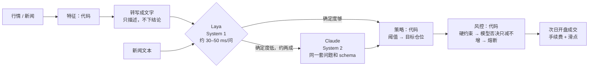
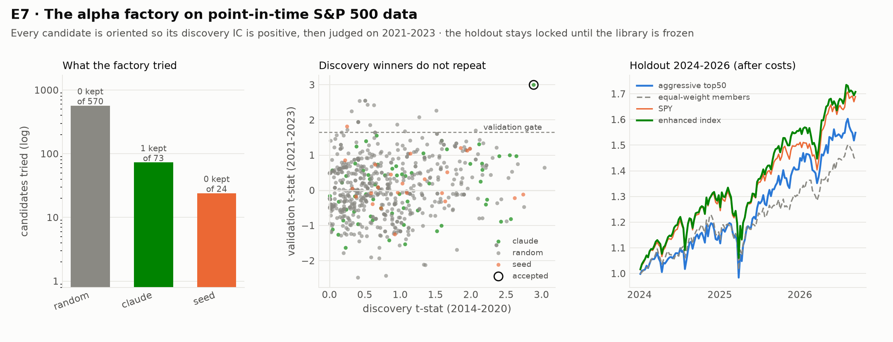

# jev-as-quant

**把 System-1 决策模型（Laya / Jev）当作量化系统里的"判断层"，并和 Claude（System 2）组合使用。**
从需求分析、任务判断、架构设计、代码实现到模拟实验的完整项目，结论好的坏的都报告。

> *English abstract.* Jev (TypeSafe AI) and its open-weight counterpart Laya (Convai Innovations) return
> typed, calibrated decisions (`Choice` / `Score` / `Noul`) instead of text. This repo wires them into a
> look-ahead-free quant research stack (features → verbalizer → typed judges → code-owned policy and
> reduce-only risk → next-open execution), adds Claude as a System-2 fallback (cascade + MCP tool), and
> tests the "naturally fit for trading" claim with six experiments on a laptop. Short version: Laya is a
> good **reader of financial text**, especially when its least-certain ~20% is escalated to Claude; it is
> a poor **reader of numbers** and adds nothing over plain rules on technical indicators. On 8,677 real
> SEC 8-K press releases (2024-2026, pre-registered design) its reading agrees with the market's
> immediate reaction, but that reaction happens before a daily trader can act: no reader is profitable
> after costs. A post-hoc lead (drift after Claude-confirmed bad news) did **not** replicate on independent
> data. A full alpha factory (point-in-time S&P 500 panel, safe expression DSL, pre-registered gates,
> Claude as hypothesis generator, Laya as a near-zero-cost question-asker over 23.5k earnings releases)
> tried 667 candidates and accepted exactly one. On a locked 2024-2026 holdout it beat the equal-weight
> benchmark by +3.0%/yr (IR 0.50, t 0.83 — not significant) and lost to SPY by 3.8%/yr. **The market was
> not beaten.**

> ⚠️ 仅供研究和教育用途。没有券商接口，不会下单，任何输出都不构成投资建议。

---

## 结论速览

| 原来的说法 | 实测 | 判断 |
|---|---|---|
| 毫秒级决策 | 本机 M3 Pro：新闻单问题 **34 ms**；一段行情描述每个问题 **55 ms**，而且随问题数**线性**增长（6 个问题 309 ms）。CPU 上慢 3 倍 | ✅ 日频、分钟级够用；❌ 高频不行（E1） |
| 能直接看技术指标做买卖 | 给原始数字时，Laya 连"RSI 是否大于 70"都答不准（平衡准确率 **0.52**，和瞎猜差不多）；数字转成文字后到 0.76，但一行 `if` 是 1.00 | ❌ 数字判断必须交给代码（E2） |
| 读新闻、判断利好利空 | 零样本 Laya macro-F1 **0.71**（校准后），好于关键词词典（0.62），不如用 9.5k 条标注训练的 TF-IDF（0.76） | ✅ 零样本就能用，**但必须先校准**（ECE 0.22 → 0.02）（E3） |
| 和 Claude 结合 | 只把 Laya 最没把握的 **18%** 交给 Claude：macro-F1 0.71 → **0.78**，超过 TF-IDF；Claude 成本约 **每千条 $0.36** | ✅ 效果最好的组合（E3） |
| 策略路由（市场状态） | 合成市场有真值：规则的平衡准确率 0.50，Laya 0.37，**危机召回率为 0**；按 Laya 的判断路由，收益和规则差不多（差异在噪声范围内） | ⚠️ 没有增量（E4） |
| 新闻驱动交易 | 合成市场里捕获的植入新闻冲击：词典 0.49 · Laya 0.56 · TF-IDF 0.58 · **Laya→Claude 0.68** | ✅ 级联最好（E4） |
| 风控判断 | Laya 的"避险"判断只在 6% 的危机时刻触发，规则是 40% | ❌ 风控用代码（E4） |
| 真实市场的买卖信号 | 8 只 ETF、2014–2026 周频：Laya english **永远回答"买入"**，typed-decisions **从不回答"持有"**；Sharpe 0.52 vs 规则 0.62，置信区间重叠；所有信号对下周收益的 IC 都不显著 | ❌ 纯技术面没有增量（E5） |
| **真实新闻 + 真实股价（2024–2026）** | 453 家标普 500 公司的 8,677 条 SEC 公告：Laya 读出的方向和市场即时反应一致（t=2.8，加 Claude 后 t=4.9），但这部分反应发生在**我们能成交之前**；能成交之后，所有读法扣成本都亏（Sharpe −0.4 到 −1.9） | ❌ 读得对，但赚不到钱（E6） |
| 坏消息的后续漂移 | E6 事后发现的线索（Claude 判利空的公告成交后 5 天再跌 74 bp，t=−2.4），拿 2016–2023 的独立样本重新检验：**没有复现**（开发期 t=0.87，验证期 t=0.45） | ❌ 事后线索经不起检验（E7） |
| **自己找 alpha** | 把 667 个候选（24 个教科书种子 + 570 个随机公式 + 73 个 Claude 假设）送进事先定死的关卡：**只有 1 个通过**——`rank(ts_sum(gap,63)) * rank(sue)`（Claude 提出：财报即时反应 × 盈利意外），验证期 t=3.0、扣成本多空 Sharpe 1.12 | ✅ 流程可信，产出稀少（E7） |
| **能不能跑赢大盘** | 留出期 2024-01～2026-09（此前从未打开）：前 50 等权组合年化 **17.5%**，超过等权基准 **+3.0%**（IR 0.50，**t=0.83 不显著**），但**输给 SPY 3.8%**；把大小盘风格剔除后的指数增强版超额 **−0.3%** | ❌ **没有跑赢大盘**（E7） |
| "零幻觉" | 厂商原话：只保证输出符合 schema，**答案本身可能是错的** | ❌ 类型安全 ≠ 判断正确 |

**一句话**：Laya 擅长**读文字**，不擅长**读数字**。它最适合当 Claude 的"快速预筛层"：大部分样本在本地几十毫秒内判完，只把没把握的那一小部分交给 Claude。
**但读对了不等于能赚钱**：在 2024–2026 年真实的公司公告上，市场在我们能交易之前就已经把信息反映进价格了。
**最后一步是做一个会自己找 alpha 的系统**（E7）：667 个候选只有 1 个通过全部关卡，留出期跑赢了等权基准（+3.0%/年）但**没有跑赢 SPY**（−3.8%/年），而且超额不显著。
真正值钱的不是"找到了 alpha"，而是**那套会把假 alpha 拦下来的关卡**——它拦掉了 666 个。

## 文档

| | |
|---|---|
| [01 需求分析](docs/01-需求分析.md) | 目标用户、功能与非功能需求、不做什么、验收标准 |
| [02 任务判断](docs/02-任务判断.md) | 调研事实、逐条核实原始说法、量化任务适配矩阵、实验前写下的假设、和 Claude 的分工 |
| [03 架构设计](docs/03-架构设计.md) | 设计原则、分层、一次决策的时间线、与 Claude 的三种结合方式、模块地图 |
| [04 实验报告](docs/04-实验报告.md) | E1–E6 的完整结果与结论（E6 = 真实新闻 + 真实股价，设计先于结果提交） |
| [05 演示：Claude 调用 Laya](docs/05-演示-Claude调用Laya.md) | Claude Code 通过 MCP 让 Laya 初筛新闻，再自己复核难例（真实运行记录） |
| [06 Alpha 工厂](docs/06-Alpha工厂.md) | 自己找 alpha + 反哺迭代：数据层、关卡、三个回路、E7 完整结果与最终考试 |
| [reports/RESULTS.md](reports/RESULTS.md) | 自动生成的全部数据表 |

## 架构



设计原则：**模型负责判断，代码负责执行**；**代码算数，模型读字**；**模型的风控意见只能减仓**；**所有引擎共用同一套 Choice / Score / Noul 格式**（Laya、Jev、Claude、规则都能直接替换）。详见 [03 架构设计](docs/03-架构设计.md)。

## 实验结果

<picture><source media="(prefers-color-scheme: dark)" srcset="reports/figures/e7_alpha_factory-dark.png"></picture>

**E7：Alpha 工厂（2014–2026，标普 500 point-in-time）。**
- **左图**：667 个候选按来源分布，只有 1 个走完全部关卡。
- **中图**：开发期的 t 值和验证期的 t 值几乎不相关——这正是防过拟合关卡在起作用。如果只看开发期，能"找到"几十个 alpha。
- **右图**：留出期（2024-01 起，此前从未打开）的净值。跑赢了等权基准，但没跑赢 SPY。

<picture><source media="(prefers-color-scheme: dark)" srcset="reports/figures/e6_real_news-dark.png"></picture>

**E6：真实公告 + 真实股价（2024–2026）。**
- **左图**：各种读法判断的利好 / 利空方向，和市场的即时反应一致，级联最准。但这段反应我们交易不到。
- **中图**：等我们能成交之后，已经没有显著的超额收益了，和"打乱标签"的区间重叠。
- **右图**：扣成本后，所有读法都是负收益。级联亏得最少，"全部当利好"亏得最多。

<picture><source media="(prefers-color-scheme: dark)" srcset="reports/figures/e3_news-dark.png"></picture>

**E3：读新闻。** 零样本 Laya 好于词典、不如有监督的 TF-IDF；校准把概率修正准了；把最没把握的样本交给 Claude，效果就超过 TF-IDF。整个过程只用了 1,500 条标注做校准，TF-IDF 用了 9,543 条。

<picture><source media="(prefers-color-scheme: dark)" srcset="reports/figures/e4_synthetic-dark.png"></picture>

**E4：真值已知的合成市场。** 只看技术指标时，Laya 识别市场状态不如规则；新闻文本来自真实推文时，级联捕获的新闻 alpha 最多。

<picture><source media="(prefers-color-scheme: dark)" srcset="reports/figures/e2_numeracy-dark.png"></picture>

**E2：Laya 读不了数字。** 同样的市场状态，给原始 JSON 时判断接近瞎猜；写成带形容词的句子才好一些，但仍然比不上一行 `if`。

<picture><source media="(prefers-color-scheme: dark)" srcset="reports/figures/e1_latency-dark.png"></picture>

**E1：延迟。** 短文本和官方 T4 数据一致（约 33 ms），但每多问一个问题就多一份开销。

<picture><source media="(prefers-color-scheme: dark)" srcset="reports/figures/e5_real-dark.png"></picture>

**E5：真实 ETF。** 只看技术指标时，Laya 相对规则没有增量，而且两个 checkpoint 都有明显的回答偏置（一个永远说买，一个从不说持有）。这段大牛市里，等权买入持有的 Sharpe 最高。

## 和 Claude 怎么结合

| 方式 | 做什么 | 代码 |
|---|---|---|
| ① 级联 | Laya 判断全部样本，把确定度低的批量交给 Claude，用同一套问题和 JSON schema | `engines/cascade.py`、`engines/claude.py` |
| ② Laya 作为 Claude 的工具 | MCP server 提供 `screen_headlines`、`judge`、`recent_filings`、`market_state` 四个工具；Claude 一次筛几百条，只精读被标记的几条 | `mcp_server.py`、`.mcp.json`、`.claude/skills/laya-triage` |
| ③ Claude 当老师 | Claude 设计题目、提供标签，用来校准（将来可以蒸馏）Laya | `calibration.py` |

Claude 这边有两种调用方式：官方 `anthropic` SDK（结构化输出、拒答处理、服务端 fallback）；没有 API key 时，可以走已登录的 Claude Code CLI（`claude -p --json-schema`）。本项目的实验用的是后一种。

## 快速开始

```bash
git clone https://github.com/jiayylu/jev-as-quant && cd jev-as-quant
uv venv --python 3.11 && uv pip install -e ".[all]"   # Python >= 3.10
uv run pytest                                          # 离线：合成数据 + 假引擎，约 10 秒
```

第一次用到 Laya 时会从 Hugging Face 下载权重（`convaiinnovations/laya`，每个 checkpoint 约 1.7 GB）。

**不想下载模型也能复现**：[Release v0.2.0](https://github.com/jiayylu/jev-as-quant/releases/tag/v0.2.0) 附带了 E1–E6 的全部 59,111 条模型判断（Laya 和 Claude，只有答案和概率，不含文本）。解压到 `.cache/decisions.sqlite` 后：
- E2–E5 会全部命中缓存，不会加载模型，也不会调用 Claude；
- E6 同样如此，但要先跑 `collect_sec.py` 从 SEC 重建公告文本；
- E1 测的是延迟，必须在本地真跑。

```bash
mkdir -p .cache && gh release download v0.2.0 -p decisions-v0.2.0.sqlite.gz -O - | gunzip > .cache/decisions.sqlite
```

```bash
# 类型化问题 → Laya（问题文件就是 Jev/Laya 的原生 JSON 格式）
uv run jevquant judge --state "Shares plunge 12% after the company slashes guidance" --questions examples/questions.json
# 批量筛新闻：输出校准后的概率和 needs_review 标记
uv run jevquant screen examples/headlines.txt
# 某家美国公司最近的 SEC 公告（财报、指引、并购、高管变动），逐条给出 Laya 的判断
# SEC 要求声明身份，先设置：export SEC_USER_AGENT="你的名字 你的邮箱"
uv run jevquant filings NVDA
# 某个标的的技术面快照：Laya 和规则基线的判断并排给出（仅供研究）
uv run jevquant market SPY
# 复现全部实验（Laya 和 Claude 的调用都有缓存，重跑不会重复计算）
cd experiments && for e in e1_latency e2_numeracy e3_news e4_synthetic e5_real; do uv run python $e.py; done
# E6 需要先从 SEC 抓公告（约 1 小时，结果缓存在 data_cache/sec/）
export SEC_USER_AGENT="你的名字 你的邮箱"
uv run python collect_sec.py && uv run python e6_real_news.py && uv run python make_report.py
# E7 Alpha 工厂：先建 point-in-time 面板（成分股 + 价格 + 首次公布的财务数据），再跑工厂
uv run python collect_fundamentals.py
uv run python e7_alpha_factory.py          # A 阶段：价格 + 财务，随机搜索 + Claude 提假设
uv run python collect_sec.py --universe sp500 --since 2016-01-01 --require-item 2.02
uv run python e7_news_stage.py             # B 阶段：加上财报公告事件 + Claude 出题 Laya 作答
uv run python e7_monthly.py                # 同一批候选再按月频判一次
uv run python e7_final.py                  # 最终考试：打开 2024 年起的留出期（只能跑一次）
```

> ⚠️ `e7_final.py` 会打开留出期。它只应该在所有关卡都跑完之后运行一次——留出期一旦看过，就不再是留出期了。

### 在 Claude Code 里使用（Laya 成为 Claude 的一个工具）

```bash
claude mcp add laya -- uv run --directory "$(pwd)" --extra all jevquant-mcp
```

仓库里已经带了 `.mcp.json` 和 `.claude/skills/laya-triage`，在仓库目录里打开 Claude Code 会自动识别。然后可以直接说"帮我筛一下这 200 条新闻"：Claude 先调用 `screen_headlines` 一次拿到全部结果，再只精读 `needs_review` 的那几条。

### 在代码里使用

```python
from jevquant import Choice, Noul, Score
from jevquant.engines import CascadeEngine, load_engine

laya = load_engine("laya:typed-decisions")       # 本地、开源权重
jev = load_engine("jev")                         # TypeSafe 托管 API（需要 TYPESAFE_API_KEY）
claude = load_engine("claude-api")               # 官方 anthropic SDK；没有 key 可以用 "claude-code"
engine = CascadeEngine(fast=laya, slow=claude, threshold=0.3)

d = engine.system_one("Apple beats estimates and raises guidance", {
    "sentiment": Choice("How will this move the stock?", {"bullish": "up", "bearish": "down", "neutral": "no effect"}),
    "surprise": Score("How surprising is it?", ["expected", "somewhat", "very"]),
    "guidance": Noul("The headline is about guidance."),
})
print(d["sentiment"].choice, d["sentiment"].probabilities, d.escalated, d.latency_ms)
```

## 目录结构

```
src/jevquant/
  typed.py            Choice / Score / Noul 及其答案类型（与 Jev/Laya 的 wire format 一致）
  engines/            laya.py  jev.py  claude.py  cascade.py  cache.py
  data/               synthetic.py  news.py  yahoo.py  sec.py（SEC 8-K 公告：限速、缓存、新闻稿提取）
  judges.py           4 个 Judge（信号 / 风控 / 路由 / 新闻）+ Reader
  verbalize.py        特征 → 文字（只描述，不下结论）
  features.py  strategies.py  risk.py  backtest.py  calibration.py  metrics.py
  alpha/              panel.py（point-in-time 面板）  fundamentals.py  dsl.py（安全表达式语言）
                      lab.py（切分 / IC / 台账）  factory.py（关卡 + 组合）  events.py
  service.py  mcp_server.py  cli.py
data_cache/           运行时下载的行情和推文（不提交）
experiments/          e1 … e7 实验脚本、collect_sec.py / collect_fundamentals.py（抓数据）、make_report.py
reports/              实验输出的 JSON、图表、RESULTS.md
docs/                 01 需求分析 · 02 任务判断 · 03 架构设计 · 04 实验报告 · 05 演示 · 06 Alpha 工厂
tests/                离线单元测试 + 可选的真实 Laya 一致性测试
```

## 局限与下一步

- **合成市场是我设计的**：状态参数、新闻冲击的大小和时序都是假设。它的作用是"真值已知的测试台"，不能代表真实市场的收益。
- **E6 用的是公司自己发的公告，不是媒体报道**：公告时间精确，但措辞偏正面；而且只有日线数据，最早只能在下一个开盘价成交，盘中更快的反应测不到。
- **E6 的股票池有幸存者偏差**：选的是目前还在标普 500 里、且 2024 年前就已纳入的公司，期间被移出指数的公司不在样本里。
- **E7 的超额收益不显著**：留出期只有 2.7 年，按 0.50 的信息比率，要判断它是不是真的，需要 4 年以上。现在还不能说这个 alpha 站得住。
- **E7 没有跑赢 SPY**：赢的是等权基准。2024–2026 年大盘股远好于中小盘，这个风格差异（约 7%/年）比选股赚到的（3%/年）更大。用市值权重做底仓、只按信号倾斜之后，超额就消失了。
- **E7 的股票池同样有幸存者偏差**：2013 年以来进过标普 500 的股票里有 169 只拿不到价格（退市或被收购），覆盖率 87.6%（2024 年起约 97%）。
- **Jev 没有实测**：目前需要排队申请。客户端是按公开文档写的，只和本地模拟服务器对过协议。
- **只做了校准，没有微调**：官方的微调笔记本需要 2×T4 跑 4～5 小时。用 Claude 的标签蒸馏 Laya 是最值得做的下一步。
- **对抗文本**：新闻是外部写的文字，可能被刻意操纵。风控层保证模型突破不了限额，但判断本身仍然可能被带偏。

## 参考资料

- Laya：[官网](https://laya.convaiinnovations.com/) · [GitHub](https://github.com/NandhaKishorM/laya) · [Hugging Face](https://huggingface.co/convaiinnovations/laya-typed-decisions) · [PyPI `laya`](https://pypi.org/project/laya/)
- Jev：[MarkTechPost 发布报道](https://www.marktechpost.com/2026/09/19/typesafe-ai-releases-jev/) · [实践指南（dev.to）](https://dev.to/valyuai/how-to-use-jev-a-practical-guide-to-typesafes-system-one-model-g5e) · [Cloudflare 模型文档](https://developers.cloudflare.com/ai/models/typesafe/jev/)
- 社区：[Jev 金融与交易项目汇总（gist）](https://gist.github.com/drillan/6916b16e8ea31a8ec36c8f59d6483150) · [buberlo/jev-trader](https://github.com/buberlo/jev-trader)
- 数据：[zeroshot/twitter-financial-news-sentiment](https://huggingface.co/datasets/zeroshot/twitter-financial-news-sentiment)（MIT）· Yahoo Finance（通过 `yfinance`，运行时下载，不再分发）

## 许可

Apache-2.0。Laya 权重同为 Apache-2.0；数据集按各自的许可在运行时下载。
