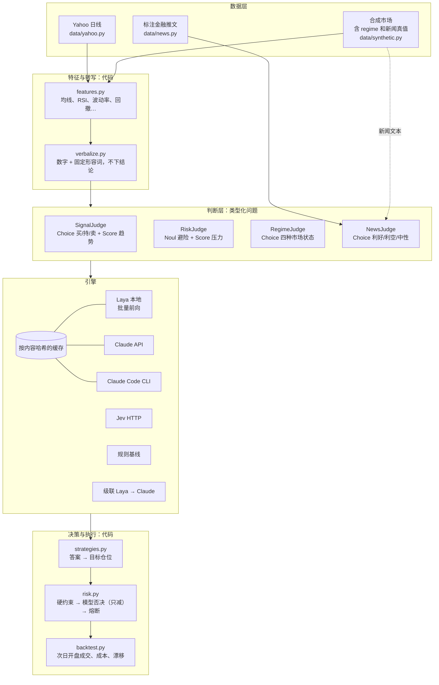
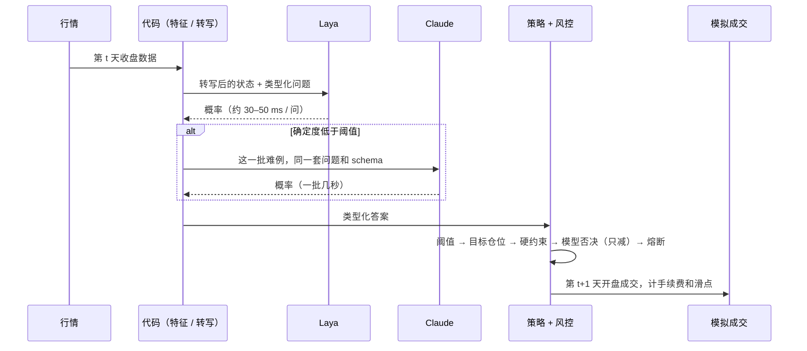
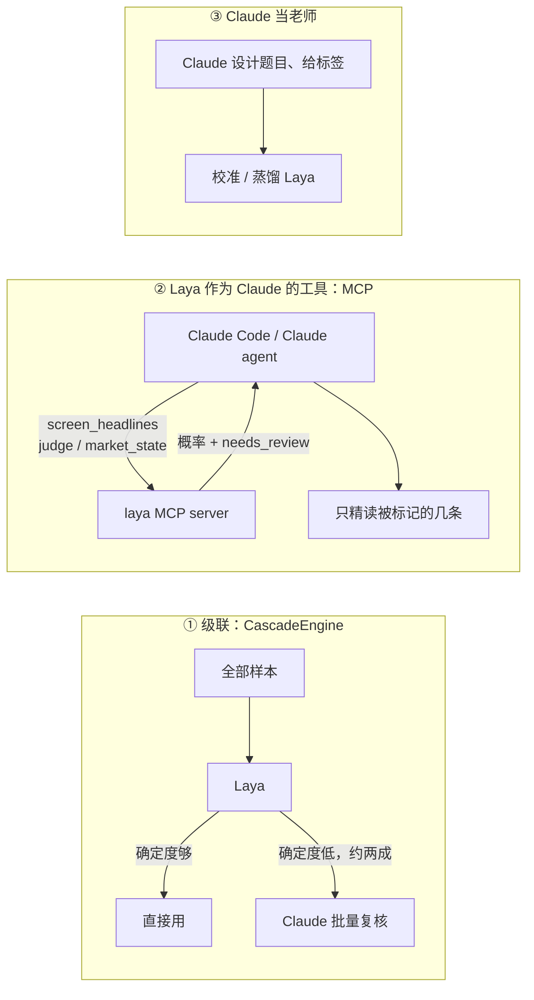

# 03 · 架构设计

## 1. 设计原则

1. **模型负责判断，代码负责执行。** 模型只回答类型化问题；阈值、仓位、风控、成交都写在代码里，可以测试，也能复现。
2. **代码算数，模型读字。** 特征由代码计算，再由转写器（verbalizer）变成"数字 + 固定形容词"的描述。转写器**只描述单个指标，从不给综合结论**（不会写"上涨趋势"或"该买入"），综合判断留给模型，规则基线则用手写逻辑做同样的综合。这样两者的对比才公平。E2 说明了为什么必须这么做。
3. **模型的风控意见只能减仓。** 硬约束在前，模型的否决乘数被截断到 [0, 1]，最后还有回撤熔断兜底。就算模型答错，甚至被新闻里的对抗文本诱导，也突破不了限额（有随机化性质测试覆盖）。
4. **所有引擎用同一套问题格式。** `Choice / Score / Noul` 的 JSON 与 Jev 和 Laya 原生格式一致；Claude 用同一套问题和 JSON schema 回答；规则基线返回同样的类型。换引擎只需要改一行。
5. **没有前视偏差。** 收盘时决策，次日开盘成交，持仓在两次调仓之间随价格漂移。
6. **每一次判断都有账可查。** 每个 `Decision` 都带引擎名、延迟、token 用量、成本、是否来自缓存、是否被升级给 Claude。

## 2. 分层

## 3. 一次决策的时间线

## 4. 和 Claude 的三种结合方式

- **①** 适合批处理和回测，完全由代码控制，成本可以算清楚。
- **②** 适合人在回路的投研。不需要改 Claude 本身，一个 MCP server 就让 Laya 成了 Claude 的一部分。
- **③** 让 Laya 在自己的领域里变得更准。目前实现的是校准。

## 5. 模块地图

| 模块 | 职责 |
|---|---|
| `typed.py` | 问题和答案的类型、wire format 互转、跨引擎统一的确定度（1 − 归一化熵） |
| `engines/laya.py` | 官方单条调用（低延迟路径）；把多个状态打包成一次前向（吞吐路径），与官方实现逐项对齐 |
| `engines/jev.py` | 按公开 API 文档实现的 `/v1/systemone` 客户端，只用标准库，带重试 |
| `engines/claude.py` | 同一套问题渲染成提示词 + JSON schema；API（结构化输出、拒答处理、fallback）和 CLI 两种传输 |
| `engines/cascade.py` | 快引擎全部回答，低确定度的一批交给慢引擎，记录升级比例 |
| `engines/cache.py` | SQLite 缓存，键是 sha256(引擎指纹, 状态, 问题) |
| `judges.py` | 4 个 Judge（问题 + 状态展示方式 + 规则基线），以及 Reader 抽象 |
| `verbalize.py` | 特征 → 文字；另有 `raw_state` 用于 E2 消融 |
| `strategies.py` | 买入持有、信号、路由、新闻、风控否决 |
| `risk.py` | 单资产上限、总敞口上限、波动率目标、模型否决（只减）、回撤熔断 |
| `backtest.py` | 日频事件循环 |
| `calibration.py` | 温度 + 类别偏置校准，只在训练集上拟合 |
| `metrics.py` | 收益和风险、分块 bootstrap 的 Sharpe 置信区间、IC、分类指标、ECE、可靠性分箱 |
| `service.py` / `mcp_server.py` / `cli.py` | 对外的三个操作，分别通过 MCP 和命令行提供 |

## 6. 扩展点

- **接入 Jev**：`load_engine("jev")`，设置 `TYPESAFE_API_KEY`，其他代码不用动。
- **换 Claude 模型或传输方式**：`ClaudeAPIEngine(model=...)` 或 `ClaudeCodeEngine(...)`。
- **新的判断**：写一个 Judge（问题 + `state()` + `baseline()`），所有引擎、缓存、级联、回测都能直接用。
- **真实新闻源**：`NewsStrategy` 只需要一张 `date, symbol, text` 表。
