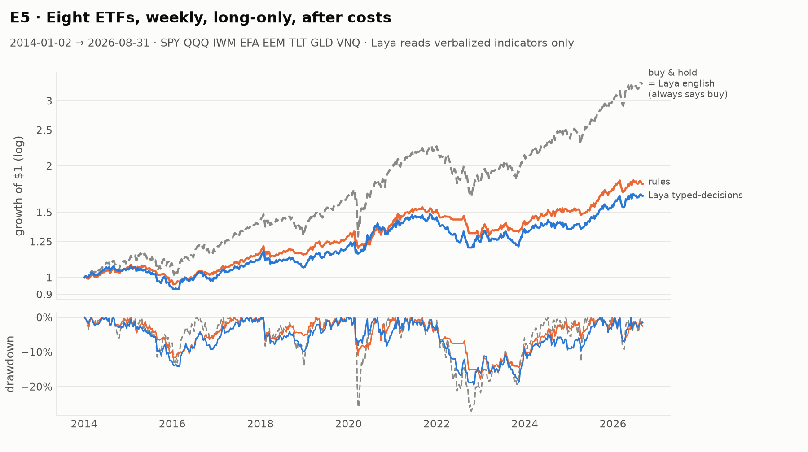
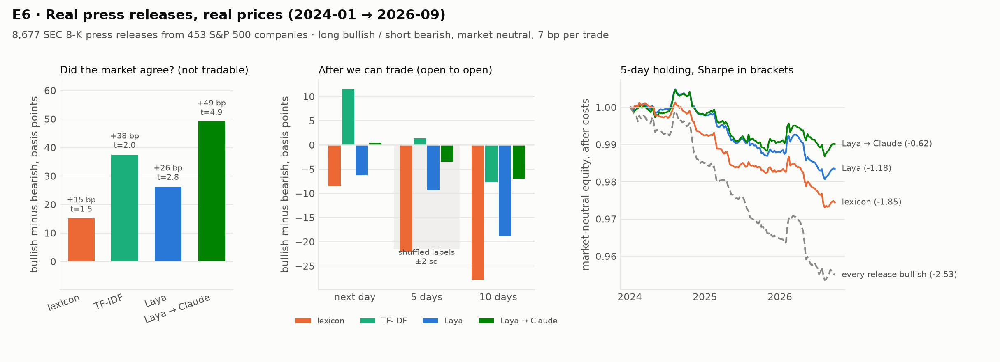

# 04 · 实验报告

全部数字由 `experiments/` 下的脚本生成，原始结果在 `reports/*.json`，完整表格见 [reports/RESULTS.md](../reports/RESULTS.md)。
机器：Apple M3 Pro（18 GB），PyTorch 2.14 MPS，`laya` 0.3.5。Claude 统一用 Claude Opus 5（effort=low），通过无头 Claude Code 调用。

---

## E1 · 延迟：本地 Laya 到底有多快

| 场景（typed-decisions） | M3 Pro GPU | 同一台机器 CPU |
|---|---|---|
| 一条新闻（约 20 token），1 个问题 | **34 ms** | 114 ms |
| 一段行情描述（约 110 token），1 个问题 | 55 ms | 177 ms |
| 同上，3 个问题 | 150 ms | 431 ms |
| 同上，6 个问题 | 309 ms | 831 ms |
| 64 条状态批量，3 个问题（折算到每条） | 152 ms | 384 ms |

**结论**

- 短文本单问题 34 ms，和官方 T4 的 32.8 ms 一致。说"几十毫秒"是对的。
- **延迟随问题数线性增长。** Laya 的实现是每个问题单独拼一条序列（状态会被重复编码），所以"多问几个几乎不增加延迟"在本机不成立。这个说法来自 Jev 的官方指南，指的是 Jev 自己的并行采样器，不能套在 Laya 上。
- 在 MPS 上，多条状态一起批量几乎不提速（152 vs 150 ms），因为已经是算力瓶颈；CPU 上批量能快 11%。
- 放到交易场景：日频、小时级、分钟级都绰绰有余；毫秒级做市需要 GPU 并且只问一两个问题；**高频完全不可行**。假设 H1 成立。

## E2 · 读数能力：为什么必须先把数字转成文字

5 道题，每道都是对某一个数的阈值判断（RSI>70、价格在 50 日均线上方……），一行 `if` 就能 100% 答对。同样的 400 个市场状态用三种写法给 Laya：

| 写法（5 题平均） | english 平衡准确率 | typed-decisions 平衡准确率 | typed-decisions AUC |
|---|---|---|---|
| 原始 JSON 数字 | 0.58 | **0.52** | 0.72 |
| 数字写成句子 | 0.69 | 0.68 | 0.80 |
| 数字 + 定性形容词（本项目的转写器） | **0.78** | 0.76 | **0.88** |

**结论**

- 直接给 JSON，Laya 的是 / 否判断基本是**抛硬币**（平衡准确率 0.50～0.56）。AUC 还有 0.72，说明概率的**方向**大体是对的，但从来不会越过 0.5 这条线，所以用来直接做决定没有意义。
- 文字化后明显变好，但**依然远不如一行 `if`**。而且提升取决于转写器的用词和问题的用词是否一致：
  - "价格在 50 日均线上方"：0.93（转写器写的正是"above its 50-day average"）。
  - "波动率高于一年常态"：0.58。转写器写的是"Volatility is elevated: 1.7x its one-year norm"，模型没有把 elevated 和"高于常态"对上。
- **设计上的推论**：阈值判断永远用代码做。模型只用在**综合多条已经文字化的线索**，或者**本来就是文字**的输入上。假设 H2 成立。

## E3 · 读新闻：Laya 的主场，以及 Claude 能补多少

数据：`zeroshot/twitter-financial-news-sentiment`，人工标注利好 / 利空 / 中性。验证集 2,388 条只用来评估，其中中性占 66%。

| 读者 | 准确率 | macro-F1 | Brier | ECE | 每条耗时 | 需要的标注 |
|---|---|---|---|---|---|---|
| 关键词词典（规则，事先写好，不调参） | 73.0% | 0.62 | 0.456 | 0.130 | 0.004 ms | 0 |
| TF-IDF + 逻辑回归 | **83.0%** | 0.76 | **0.244** | 0.030 | 0.008 ms | 9,543 条 |
| Laya english，零样本 | 77.5% | 0.69 | 0.387 | 0.171 | 28 ms | 0 |
| Laya typed-decisions，零样本 | 72.8% | 0.70 | 0.469 | 0.218 | 28 ms | 0 |
| Laya typed-decisions + 校准 | 78.6% | 0.71 | 0.311 | **0.020** | 28 ms | 1,500 条（只用来拟合 4 个参数） |
| Laya multilingual，零样本 | 38.3% | 0.40 | 0.811 | 0.318 | 11 ms | 0 |
| **级联：Laya + 校准 → Claude（升级 18%）** | 82.5% | **0.78** | 0.270 | 0.029 | 28 ms + 18% × 约 15 s/批 | 1,500 |

随机抽 300 条单独评估 Claude（同一批样本）：Claude macro-F1 **0.76**，Laya + 校准 0.71，TF-IDF 0.71，词典 0.58。

级联曲线（把 Laya 最没把握的 x% 交给 Claude）：

| 升级比例 | 0% | 5% | 10% | 15% | 20% | 25% |
|---|---|---|---|---|---|---|
| macro-F1 | 0.706 | 0.724 | 0.738 | 0.764 | 0.782 | 0.793 |
| Claude 成本，每千条 | $0 | $0.10 | $0.20 | $0.29 | $0.39 | $0.49 |

**结论**

- 零样本 Laya 明显好于词典（macro-F1 0.69～0.71 vs 0.62），但**不如**用 9,500 条标注训练、训练只要 0.5 秒的 TF-IDF（0.76）。**如果你有标注数据，经典模型依然很强。** 假设 H3 的前半部分成立。
- **Laya 原始输出的概率不校准**：typed-decisions 的 ECE 是 0.218，而且系统性地少报"中性"。用 1,500 条训练样本拟合温度加偏置（4 个参数）之后，ECE 降到 0.020，准确率从 72.8% 升到 78.6%。**上线前必须先校准。**
- multilingual checkpoint 在英文金融文本上几乎不可用（零样本 0.40）。
- **级联是这组实验里最好的方案**：只把 18% 的样本交给 Claude，macro-F1 就从 0.71 升到 0.78，超过了 TF-IDF，Claude 成本约每千条 $0.39。升级比例、阈值都用训练集定，不看验证集。假设 H3 的后半部分成立。
- Claude 这边一共判断了 821 条，每次请求 40 条，4 路并发，总耗时 86 秒，按标价折算 $1.61（本次走的是 Claude Code 订阅额度）。

## E4 · 合成市场：真值已知时，Laya 读到了什么

设置：4 个资产，6 年日线，价格在四种状态之间切换（上涨、下跌、震荡、危机），状态本身不可见。新闻按泊松过程到达：**文本是真实的人工标注推文**（验证集），**价格冲击按标注方向生成**：利好涨、利空跌、中性不动。冲击的 30% 发生在隔夜跳空里，这部分在次日开盘才成交的策略是拿不到的；其余 70% 在之后 5 个交易日逐步体现。seed 0 是开发集，只用来选否决阈值；报告的是 seed 1–3 的均值 ± 标准差。

**A. 市场状态识别**（每周一次，4 个资产）

| 读者 | 准确率 | 平衡准确率（瞎猜 = 0.25） | 危机召回率 |
|---|---|---|---|
| 规则 | 0.54 | **0.50** | **0.38** |
| Laya english | 0.50 | 0.34 | 0.00 |
| Laya typed-decisions | 0.53 | 0.37 | 0.00 |

**B. 按状态路由的多空策略**

| 策略 | Sharpe | 年化收益 | 最大回撤 |
|---|---|---|---|
| 买入持有 | 0.20 ± 0.96 | 2% | −38% |
| 路由（规则） | 0.61 ± 0.43 | 5% | −15% |
| 路由（Laya english） | 0.79 ± 0.38 | 7% | −23% |
| 路由（Laya typed-decisions） | 0.87 ± 0.26 | 8% | −18% |
| 路由（真值状态） | 3.05 ± 0.11 | 29% | −6% |

**C. 新闻交易**（每天决策，多空，含成本）

| 读者 | 新闻判断准确率 | **捕获的植入冲击**（无噪声） | Sharpe |
|---|---|---|---|
| 关键词词典 | 0.74 | 0.49 ± 0.04 | 1.75 |
| TF-IDF（9.5k 标注） | 0.83 | 0.58 ± 0.04 | 2.00 |
| Laya typed-decisions + 校准 | 0.78 | 0.56 ± 0.05 | 1.58 |
| **级联 Laya → Claude（约 17% 升级）** | 0.80 | **0.68 ± 0.05** | 1.91 |
| 真值 | 1.00 | 1.00 | 3.05 |

"捕获的植入冲击" = Σ(方向 × 冲击) / Σ|冲击|。它直接衡量读者拿到了多少人为放进去的新闻 alpha，不受价格随机游走的影响。回测收益也记录了，但噪声大到会让名次来回变，所以作为次要指标。

**D. 风控否决**（加在规则路由策略上；Laya 的阈值 τ=0.6 在 seed 0 上选定）

| 版本 | Sharpe | 最大回撤 | 否决时刻确实处于危机的比例 | 危机中被否决的比例 |
|---|---|---|---|---|
| 不否决 | 0.61 | −15% | – | – |
| 规则否决 | 0.64 | −15% | 63% | 40% |
| Laya 否决 | 0.62 | −15% | 67% | **6%** |

**结论**

- **只看技术指标时，Laya 识别市场状态不如规则。** 它几乎从不回答"危机"（召回率 0），也很少回答"震荡"，大多数时候落在"上涨"或"下跌"。假设 H4 的前半部分成立。
- **但是按 Laya 的判断去路由，收益并不差**（Sharpe 0.87 vs 0.61）。一个可能的解释（没有单独验证）是 Laya 的判断偏向"上涨 / 下跌"，路由就更多地走趋势分支，而趋势分支恰好吃到了这个市场里的漂移。**识别准确率和交易收益不是一回事**；而且只有 3 个 seed，标准差和差值相当，不能说 Laya 更好。
- **新闻是 Laya 真正有用的地方，级联是最好的读法**：Laya 单独 0.56，与 TF-IDF（0.58）相当；把最没把握的约 17% 交给 Claude 之后提升到 **0.68**，比 Laya 单独多拿 12 个百分点的植入冲击，比 TF-IDF 多 10 个百分点。TF-IDF 的准确率最高（0.83），但准确率主要来自占多数的"中性"，真正产生收益的利好 / 利空判断上并不占优。
- **Laya 当风控否决基本没用**：P(避险) 超过 0.6 的情况极少（每个 seed 只有 3 次否决），危机里只拦住了 6%；规则能拦住 40%。两者都没有改变最大回撤，一个原因是规则路由在识别出危机时本来就会空仓，否决就没什么可拦的了。

## E5 · 真实 ETF：只看技术指标时，Laya 有没有增量

设置：SPY、QQQ、IWM、EFA、EEM、TLT、GLD、VNQ 共 8 只 ETF，2014-01 到 2026-08，每周五收盘决策、下周一开盘成交，只做多，单只上限 25%，手续费 5 bp + 滑点 2 bp，一共 662 次决策。**这批数据上没有拟合任何东西**：问题、阈值、否决阈值 τ=0.6 全部沿用合成市场开发集的设定。

| 策略 | 年化收益 | 波动 | Sharpe [95% CI] | 最大回撤 | 年换手 |
|---|---|---|---|---|---|
| 等权买入持有 | 10.0% | 13.3% | **0.78** [0.23, 1.37] | −27.1% | 0.7× |
| 信号（规则） | 4.7% | 7.9% | 0.62 [0.15, 1.13] | −17.9% | 5.5× |
| 信号（Laya english） | 10.0% | 13.3% | 0.78（**永远回答"买入"**，等于买入持有） | −27.1% | 0.7× |
| 信号（Laya typed-decisions） | 4.1% | 8.4% | 0.52 [−0.02, 1.05] | −19.5% | 11.6× |
| 路由（规则） | 3.1% | 6.7% | 0.48 [0.01, 0.95] | −15.0% | 12.1× |
| 路由（Laya typed-decisions） | 5.2% | 8.2% | 0.66 [0.16, 1.19] | −16.4% | 9.4× |
| 信号（规则）+ 规则否决 | 4.6% | 7.8% | 0.62 | −17.9% | 5.5× |
| 信号（规则）+ Laya 否决 | 4.8% | 7.8% | 0.64 | −17.9% | 5.5× |

对下周收益的预测力（横截面 Spearman IC，662 周）：

| 信号 | 平均 IC | t 值 |
|---|---|---|
| 规则：P(买)−P(卖) | −0.016 | −0.84 |
| 规则：趋势分 | −0.033 | −1.79 |
| Laya english：趋势分 | −0.024 | −1.39 |
| Laya typed-decisions：P(买)−P(卖) | −0.025 | −1.46 |
| Laya typed-decisions：趋势分 | −0.031 | −1.81 |

买 / 持 / 卖三选一时，与规则的一致性：Laya english κ = 0.00（100% 回答"买入"）；Laya typed-decisions 一致率 75.8%，κ = 0.49（71% 买入、29% 卖出，**从不回答"持有"**）。规则的分布是 61% 买入、31% 卖出、7% 持有。

**结论**

- **在这组真实数据上，Laya 相对规则没有增量**：所有 Sharpe 的置信区间都大面积重叠；所有趋势类信号（包括规则）对下周收益的 IC 都略为负（周频的短期反转），而且都不显著。假设 H5 成立。
- **两个 checkpoint 都有明显的回答偏置**：english 永远说"买入"，typed-decisions 从不说"持有"。换手率是规则的两倍，却没有换来更多收益。这是"判断层"上线前必须做的健康检查：先看答案分布，再看准确率。
- Laya 否决在 12 年里触发了 20 次，规则否决 70 次，对结果的影响都可以忽略。
- 2014–2026 是大牛市，等权买入持有的 Sharpe 最高。所有择时策略都用更低的回撤换来了更低的收益。**这个结果与 Laya 无关，是趋势择时在这段行情里的常态。**

---

## 总结：实验前的假设，逐条对照

| 假设 | 结果 |
|---|---|
| H1 本机几十毫秒，但延迟随问题数线性增长 | ✅ 成立：34 ms（短文本）～55 ms（每个行情问题），6 个问题 309 ms |
| H2 原始数字答不好，转成文字才行 | ✅ 成立：JSON 平衡准确率 0.52 → 文字 0.76，仍远低于一行 `if` |
| H3 零样本 Laya：好于词典、不如 TF-IDF；级联 Claude 能低成本补上 | ✅ 成立：0.71 vs 0.62 vs 0.76；升级 18% 到 Claude 后达到 0.78，每千条 $0.36 |
| H4 技术面状态识别未必比规则准；新闻 alpha 按读得好不好排序 | ✅ 状态识别成立（0.37 vs 0.50，危机召回 0）；新闻上级联最好（0.68），Laya 单独与 TF-IDF 相当 |
| H5 纯技术指标下没有显著增量 | ✅ 成立，而且两个 checkpoint 都有明显的回答偏置 |

**给想用 Jev/Laya 做量化的人的建议**

1. 把它放在**文本**上（新闻、公告、研报、电话会纪要），不要放在数字上。
2. 上线前做三件事：**校准概率**、**检查答案分布**（有没有"永远买入"这类偏置）、**确定升级阈值**。
3. 把没把握的那一小部分交给 Claude。这是本项目里性价比最高的配置。
4. 阈值、仓位、风控永远写在代码里，模型的意见只能让仓位变小。

---

## E6 · 真实新闻 + 真实股价（2024–2026）：用 Laya 读公告能不能赚钱

> 这一节的**设计在看到任何结果之前就写好并提交了**（commit `6431e6b`），结果部分是后来补上的。

**为什么是 SEC 8-K 公告。** 找免费的 2024–2026 年美股新闻时，核实过的几个数据集各有硬伤：
- FNSPID 只到 2023 年；
- AlphaDojo 每只股票只保留最近 200 条，美股部分还没有具体时间；
- FENRIX 近年基本只有 GDELT 数据。

8-K 是上市公司向 SEC 提交的重大事件公告，比如财报、并购、业绩指引、高管变动。它官方、完整、免费，而且**提交时间精确到秒**，是最干净的来源。缺点是公告由公司自己撰写，措辞普遍偏正面；这一点靠下面的"全部当利好"对照组来控制。

**数据**
- **股票池**：当前标普 500 成分股中，2024 年之前就已纳入的 453 家（不选因 2024–2026 年表现好才被纳入的公司）。
- **新闻**：2024-01-01 以来它们全部 8-K 所附的新闻稿（EX-99.x），取"标题 + 导语"，约 110 词。
- **股价**：Yahoo 日线，已复权。

**时间规则**
- SEC 的受理时间是 UTC；用苹果固定在美东 16:30 发布财报做过验证。
- 换算成美东时间后：9:30 前受理的，当天开盘成交；之后受理的，下一个交易日开盘成交。
- 稳健性版本：一律下一个交易日开盘成交。

**读法与交易**（全部事先固定，没有在这批数据上调任何参数）
- **Laya**：typed-decisions 版本加 E3 的校准参数，读成利好、利空或中性。
- **组合**：利好做多 1/N，利空做空 1/N，持有 5 个交易日；用 453 只股票等权对冲大盘，所以是市场中性的；每笔交易成本 5 bp 手续费 + 2 bp 滑点。
- **级联**：Laya 最没把握的那部分（确定度低于 E3 的阈值）交给 Claude 重读。

**对照组**
- **关键词词典**：事先写好，不调参。
- **TF-IDF**：用推文标注训练，没见过任何公告的标注。
- **全部当利好**：不管内容一律做多。它检验"发公告"这件事本身有没有超额收益。
- **打乱标签**：把 Laya 的标签在公告之间随机打乱 20 次，交易次数和时点完全一样，只是内容和标签的对应关系被打乱。Laya 要显著好于它，才说明"读懂内容"有用。

**指标**
- **事件研究**：发布后 1、5、10 天相对等权股票池的超额收益。按"做多利好、做空利空"的差值计算，t 值按日期聚类。
- **策略**：Sharpe 及 95% 置信区间、分年 Sharpe、持有期敏感性（1、3、5、10 天）。
- **有效性检验（交易不到）**：从发布前最后一个收盘价到第一个可交易开盘价的超额收益，也就是市场对这条公告的即时反应。Laya 的判断和市场反应方向是否一致，直接说明它读得准不准。

### E6 结果（2026-09-22 跑出）

**数据清洗**（在发现数据质量问题之后、看到任何回测结果之前确定）：
- 标题提取时过滤文件名、地址、日期行、公司名、联系人行，这些原本会被误当成标题；
- 去掉 News Corp 在澳交所提交的 1,320 份股票回购例行申报表；
- 同一份公告挂在两类股票上（GOOG/GOOGL 等）的只算一次；
- 7 天内重复提交的同一标题只算一次。

清洗后 **8,677 条新闻稿**，来自 453 家公司。其中 48% 在开盘前提交，大半是财报（8-K 事项 2.02）。

**事先定好的主要结果**

| 读法 | 判利好 / 判利空 | 市场的即时反应（交易不到）：多利好空利空 | 我们能成交后 5 天：多利好空利空 | 策略 Sharpe [95% CI] |
|---|---|---|---|---|
| 关键词词典 | 52% / 6% | +15 bp（t=1.5） | −22 bp（t=−2.3） | −1.85 [−3.26, −0.63] |
| TF-IDF（推文训练） | 22% / 2% | +38 bp（t=2.0） | +1 bp（t=0.1） | −0.42 [−1.68, 0.70] |
| Laya + 校准 | 56% / 2% | +26 bp（t=2.8） | −9 bp（t=−1.0） | −1.18 [−2.69, 0.18] |
| **Laya → Claude 级联**（升级 18%） | 59% / 5% | **+49 bp（t=4.9）** | −3 bp（t=−0.3） | −0.62 [−1.92, 0.56] |
| 全部当利好 | 100% / 0% | +2 bp（t=−0.1） | −7 bp（t=−1.6） | −2.53 [−4.12, −0.76] |
| 打乱标签（20 次） | 同 Laya | — | −11 ± 5 bp | −2.19 ± 0.17 |

稳健性：
- 2024、2025、2026 三年分开看，所有读法的 Sharpe 都为负；
- 持有期换成 1、3、10 天，结论不变；
- 改成"一律次日开盘成交"后更差：Laya −1.91，级联 −1.84。

**结论**

1. **读法质量和市场反应一致。** 按"读出的方向和即时价格反应的吻合程度"排序：级联（t=4.9）> Laya（2.8）> TF-IDF（2.0）> 词典（1.5），和 E3 在标注数据上的排序相同。级联判为利空的公告，从发布到第一个可交易开盘，平均已经跌了 2.4%（65% 的情况确实下跌）。
2. **但钱在我们能成交之前就被赚走了。** 这些反应几乎全部发生在隔夜跳空里：一半公告在收盘后发，一半在开盘前发。等到可以成交时，已经没有显著的超额收益。**所有读法扣成本后都不赚钱。**
3. **读懂内容是有信息量的，只是不够。**
   - Laya 判为利好的公告，5 天平均 +2 bp；所有公告的平均是 −7 bp。它确实挑出了更好的那一部分，所以策略 Sharpe（−1.18）比"打乱标签"（−2.19 ± 0.17）高出约 6 个标准差。
   - 但这点差距抵不过整体的负漂移和交易成本。
4. **不存在"发公告就涨"的效应。** 这段时间里，标普 500 公司发布新闻稿后 5 天平均略微跑输（−7 bp，t=−1.6）。

**事后发现的线索（不是事先设计的检验，只能当作待验证的假设）**

| | 条数 | 我们能成交后 5 天 | t 值（按日期聚类） |
|---|---|---|---|
| 级联判为利空 | 429 | −64 bp | −1.86 |
| 其中由 Claude 复核判为利空 | 313 | **−74 bp** | **−2.38** |
| 其中 Laya 自己判为利空 | 116 | −38 bp | −0.52 |
| 只用 Laya 判为利空 | 206 | −2 bp | 0.04 |

- 单独做空"级联判为利空"的这部分，Sharpe 0.81，95% 区间 [−0.50, 2.19]。分年看：2024 年 1.07，2025 年 1.39，2026 年 −0.29。
- 这和学术上的"坏消息公告后漂移"一致：市场对坏消息反应不足，价格会继续下行。
- 但它是看过数据之后才发现的，区间也包含 0。**要当真，必须用新数据重新检验**：比如 2026 年 10 月以后的公告，或者 2019–2023 年的独立样本。
- 数据在 `reports/e6_exploratory_bearish.json`。

**成本**：Claude 复核了 1,585 条，按标价折算 7.32 美元（走的是 Claude Code 订阅额度）。
