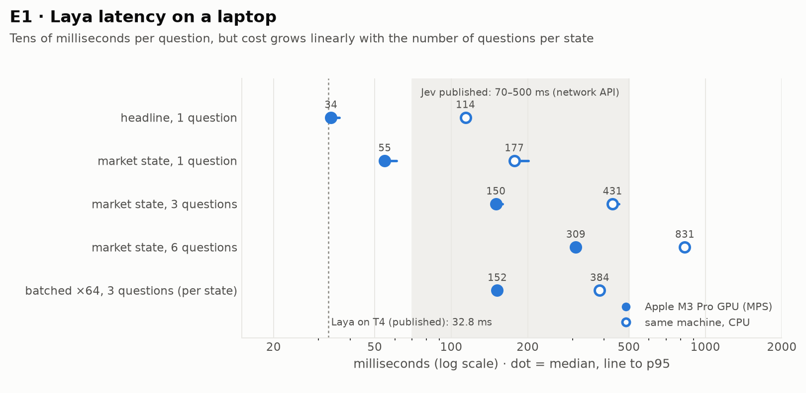
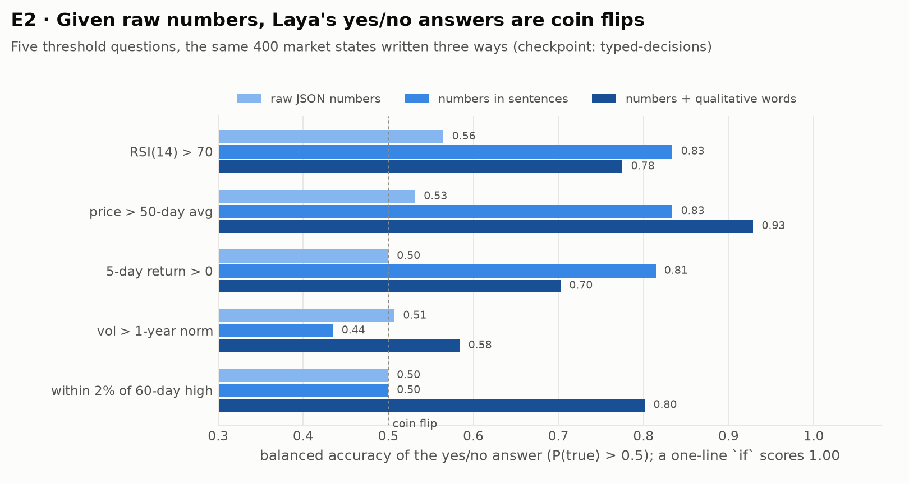
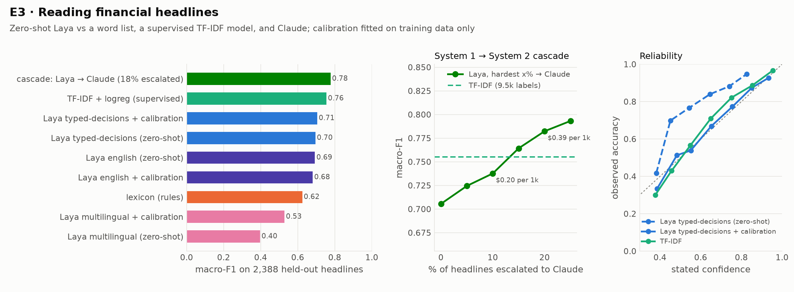
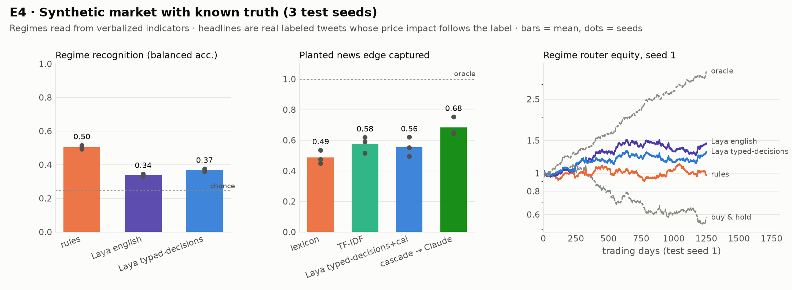

# 04 · 实验报告

全部数字由 `experiments/` 下的脚本生成，原始结果在 `reports/*.json`，完整表格见 [reports/RESULTS.md](../reports/RESULTS.md)。
机器：Apple M3 Pro（18 GB），PyTorch 2.14 MPS，`laya` 0.3.5。Claude 统一用 Claude Opus 5（effort=low），通过无头 Claude Code 调用。

---

## E1 · 延迟：本地 Laya 到底有多快

| 场景（typed-decisions） | M3 Pro GPU | 同一台机器 CPU |
|---|---|---|
| 一条新闻（约 20 token），1 个问题 | **34 ms** | 114 ms |
| 一段行情描述（约 110 token），1 个问题 | 55 ms | 177 ms |
| 同上，3 个问题 | 150 ms | 431 ms |
| 同上，6 个问题 | 309 ms | 831 ms |
| 64 条状态批量，3 个问题（折算到每条） | 152 ms | 384 ms |

**结论**

- 短文本单问题 34 ms，和官方 T4 的 32.8 ms 一致。说"几十毫秒"是对的。
- **延迟随问题数线性增长。** Laya 的实现是每个问题单独拼一条序列（状态会被重复编码），所以"多问几个几乎不增加延迟"在本机不成立。这个说法来自 Jev 的官方指南，指的是 Jev 自己的并行采样器，不能套在 Laya 上。
- 在 MPS 上，多条状态一起批量几乎不提速（152 vs 150 ms），因为已经是算力瓶颈；CPU 上批量能快 11%。
- 放到交易场景：日频、小时级、分钟级都绰绰有余；毫秒级做市需要 GPU 并且只问一两个问题；**高频完全不可行**。假设 H1 成立。

## E2 · 读数能力：为什么必须先把数字转成文字

5 道题，每道都是对某一个数的阈值判断（RSI>70、价格在 50 日均线上方……），一行 `if` 就能 100% 答对。同样的 400 个市场状态用三种写法给 Laya：

| 写法（5 题平均） | english 平衡准确率 | typed-decisions 平衡准确率 | typed-decisions AUC |
|---|---|---|---|
| 原始 JSON 数字 | 0.58 | **0.52** | 0.72 |
| 数字写成句子 | 0.69 | 0.68 | 0.80 |
| 数字 + 定性形容词（本项目的转写器） | **0.78** | 0.76 | **0.88** |

**结论**

- 直接给 JSON，Laya 的是 / 否判断基本是**抛硬币**（平衡准确率 0.50～0.56）。AUC 还有 0.72，说明概率的**方向**大体是对的，但从来不会越过 0.5 这条线，所以用来直接做决定没有意义。
- 文字化后明显变好，但**依然远不如一行 `if`**。而且提升取决于转写器的用词和问题的用词是否一致：
  - "价格在 50 日均线上方"：0.93（转写器写的正是"above its 50-day average"）。
  - "波动率高于一年常态"：0.58。转写器写的是"Volatility is elevated: 1.7x its one-year norm"，模型没有把 elevated 和"高于常态"对上。
- **设计上的推论**：阈值判断永远用代码做。模型只用在**综合多条已经文字化的线索**，或者**本来就是文字**的输入上。假设 H2 成立。

## E3 · 读新闻：Laya 的主场，以及 Claude 能补多少

数据：`zeroshot/twitter-financial-news-sentiment`，人工标注利好 / 利空 / 中性。验证集 2,388 条只用来评估，其中中性占 66%。

| 读者 | 准确率 | macro-F1 | Brier | ECE | 每条耗时 | 需要的标注 |
|---|---|---|---|---|---|---|
| 关键词词典（规则，事先写好，不调参） | 73.0% | 0.62 | 0.456 | 0.130 | 0.004 ms | 0 |
| TF-IDF + 逻辑回归 | **83.0%** | 0.76 | **0.244** | 0.030 | 0.008 ms | 9,543 条 |
| Laya english，零样本 | 77.5% | 0.69 | 0.387 | 0.171 | 28 ms | 0 |
| Laya typed-decisions，零样本 | 72.8% | 0.70 | 0.469 | 0.218 | 28 ms | 0 |
| Laya typed-decisions + 校准 | 78.6% | 0.71 | 0.311 | **0.020** | 28 ms | 1,500 条（只用来拟合 4 个参数） |
| Laya multilingual，零样本 | 38.3% | 0.40 | 0.811 | 0.318 | 11 ms | 0 |
| **级联：Laya + 校准 → Claude（升级 18%）** | 82.5% | **0.78** | 0.270 | 0.029 | 28 ms + 18% × 约 15 s/批 | 1,500 |

随机抽 300 条单独评估 Claude（同一批样本）：Claude macro-F1 **0.76**，Laya + 校准 0.71，TF-IDF 0.71，词典 0.58。

级联曲线（把 Laya 最没把握的 x% 交给 Claude）：

| 升级比例 | 0% | 5% | 10% | 15% | 20% | 25% |
|---|---|---|---|---|---|---|
| macro-F1 | 0.706 | 0.724 | 0.738 | 0.764 | 0.782 | 0.793 |
| Claude 成本，每千条 | $0 | $0.10 | $0.20 | $0.29 | $0.39 | $0.49 |

**结论**

- 零样本 Laya 明显好于词典（macro-F1 0.69～0.71 vs 0.62），但**不如**用 9,500 条标注训练、训练只要 0.5 秒的 TF-IDF（0.76）。**如果你有标注数据，经典模型依然很强。** 假设 H3 的前半部分成立。
- **Laya 原始输出的概率不校准**：typed-decisions 的 ECE 是 0.218，而且系统性地少报"中性"。用 1,500 条训练样本拟合温度加偏置（4 个参数）之后，ECE 降到 0.020，准确率从 72.8% 升到 78.6%。**上线前必须先校准。**
- multilingual checkpoint 在英文金融文本上几乎不可用（零样本 0.40）。
- **级联是这组实验里最好的方案**：只把 18% 的样本交给 Claude，macro-F1 就从 0.71 升到 0.78，超过了 TF-IDF，Claude 成本约每千条 $0.39。升级比例、阈值都用训练集定，不看验证集。假设 H3 的后半部分成立。
- Claude 这边一共判断了 821 条，每次请求 40 条，4 路并发，总耗时 86 秒，按标价折算 $1.61（本次走的是 Claude Code 订阅额度）。

## E4 · 合成市场：真值已知时，Laya 读到了什么

设置：4 个资产，6 年日线，价格在四种状态之间切换（上涨、下跌、震荡、危机），状态本身不可见。新闻按泊松过程到达：**文本是真实的人工标注推文**（验证集），**价格冲击按标注方向生成**：利好涨、利空跌、中性不动。冲击的 30% 发生在隔夜跳空里，这部分在次日开盘才成交的策略是拿不到的；其余 70% 在之后 5 个交易日逐步体现。seed 0 是开发集，只用来选否决阈值；报告的是 seed 1–3 的均值 ± 标准差。

**A. 市场状态识别**（每周一次，4 个资产）

| 读者 | 准确率 | 平衡准确率（瞎猜 = 0.25） | 危机召回率 |
|---|---|---|---|
| 规则 | 0.54 | **0.50** | **0.38** |
| Laya english | 0.50 | 0.34 | 0.00 |
| Laya typed-decisions | 0.53 | 0.37 | 0.00 |

**B. 按状态路由的多空策略**

| 策略 | Sharpe | 年化收益 | 最大回撤 |
|---|---|---|---|
| 买入持有 | 0.20 ± 0.96 | 2% | −38% |
| 路由（规则） | 0.61 ± 0.43 | 5% | −15% |
| 路由（Laya english） | 0.79 ± 0.38 | 7% | −23% |
| 路由（Laya typed-decisions） | 0.87 ± 0.26 | 8% | −18% |
| 路由（真值状态） | 3.05 ± 0.11 | 29% | −6% |

**C. 新闻交易**（每天决策，多空，含成本）

| 读者 | 新闻判断准确率 | **捕获的植入冲击**（无噪声） | Sharpe |
|---|---|---|---|
| 关键词词典 | 0.74 | 0.49 ± 0.04 | 1.75 |
| TF-IDF（9.5k 标注） | 0.83 | 0.58 ± 0.04 | 2.00 |
| Laya typed-decisions + 校准 | 0.78 | 0.56 ± 0.05 | 1.58 |
| **级联 Laya → Claude（约 17% 升级）** | 0.80 | **0.68 ± 0.05** | 1.91 |
| 真值 | 1.00 | 1.00 | 3.05 |

"捕获的植入冲击" = Σ(方向 × 冲击) / Σ|冲击|。它直接衡量读者拿到了多少人为放进去的新闻 alpha，不受价格随机游走的影响。回测收益也记录了，但噪声大到会让名次来回变，所以作为次要指标。

**D. 风控否决**（加在规则路由策略上；Laya 的阈值 τ=0.6 在 seed 0 上选定）

| 版本 | Sharpe | 最大回撤 | 否决时刻确实处于危机的比例 | 危机中被否决的比例 |
|---|---|---|---|---|
| 不否决 | 0.61 | −15% | – | – |
| 规则否决 | 0.64 | −15% | 63% | 40% |
| Laya 否决 | 0.62 | −15% | 67% | **6%** |

**结论**

- **只看技术指标时，Laya 识别市场状态不如规则。** 它几乎从不回答"危机"（召回率 0），也很少回答"震荡"，大多数时候落在"上涨"或"下跌"。假设 H4 的前半部分成立。
- **但是按 Laya 的判断去路由，收益并不差**（Sharpe 0.87 vs 0.61）。一个可能的解释（没有单独验证）是 Laya 的判断偏向"上涨 / 下跌"，路由就更多地走趋势分支，而趋势分支恰好吃到了这个市场里的漂移。**识别准确率和交易收益不是一回事**；而且只有 3 个 seed，标准差和差值相当，不能说 Laya 更好。
- **新闻是 Laya 真正有用的地方，级联是最好的读法**：Laya 单独 0.56，与 TF-IDF（0.58）相当；把最没把握的约 17% 交给 Claude 之后提升到 **0.68**，比 Laya 单独多拿 12 个百分点的植入冲击，比 TF-IDF 多 10 个百分点。TF-IDF 的准确率最高（0.83），但准确率主要来自占多数的"中性"，真正产生收益的利好 / 利空判断上并不占优。
- **Laya 当风控否决基本没用**：P(避险) 超过 0.6 的情况极少（每个 seed 只有 3 次否决），危机里只拦住了 6%；规则能拦住 40%。两者都没有改变最大回撤，一个原因是规则路由在识别出危机时本来就会空仓，否决就没什么可拦的了。

## E5 · 真实 ETF

回测运行中，结果会补在后续提交里。
